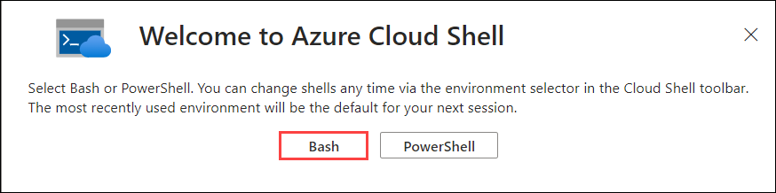
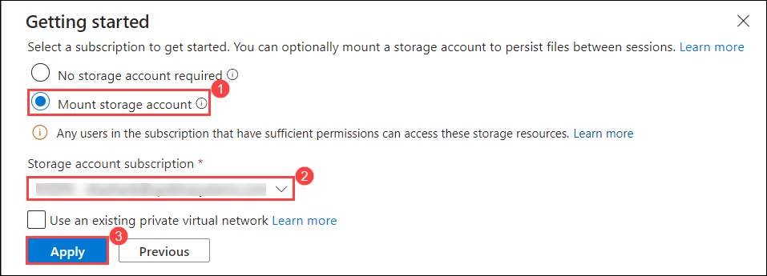
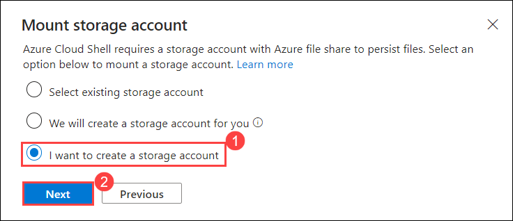
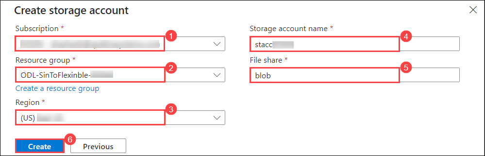
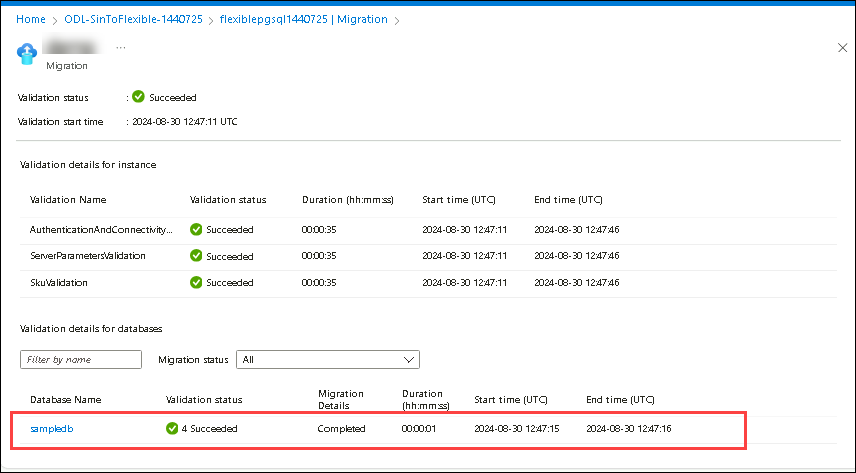

# Lab 2: Migrating the database from a Single PostgreSQL server to Flexible PostgreSQL Server using an offline method

In this Lab, you will be migrating the database from a Single PostgreSQL server to a Flexible PostgreSQL Server using the new Migration (Preview) tool.

## Lab Objectives:

- Task 1: Enable extension
- Task 2: Migrate Data Base from Azure Database for PostgreSQL single server

## Task 1: Enable extension

In this task, you will enable the necessary extensions on a flexible server in Azure Database for PostgreSQL to support specific functionalities required by your applications.

1. In the **Azure portal**, open the Azure Cloud Shell by clicking on the cloud shell icon in the top menu bar.

    
2. After launching the Azure Cloud Shell, select the **Bash** option.

    
    
3. Now on You have no storage to create storage account select **Mount storage account** and select the Available subscription from the drop down menu and then click on **Apply**.

   
   
5. To create a storage account, select **I want to create a storage account** and Click on **Next**.
   
   
   
7. Follow the below-mentioned instructions and click on **Create**. **(6)**
   
    - **Subscription**: Default - Pre-assigned subscription. **(1)**
    - **Resource group**: ODL-SinToFlenxible-<inject key="Deployment ID" enableCopy="false"></inject> **(2)**
    - **Region**: Select **<inject key="Region" enableCopy="false" />** **(3)**
    - **Storage account**: Enter **stacc<inject key="DeploymentID" enableCopy="false"/>** **(4)**
    - **File Share**: Enter **blob** **(5)**

    
    
9. Follow the below steps to connect to the **Azure Database for PostgreSQL single server**:

   - Replace the `<DID>` with **<inject key="DeploymentID" enableCopy="true"/>** in the below command and run it from bash.
    
       ```bash
       psql --host=pgsql<inject key="DeploymentID" enableCopy="false"/>.postgres.database.azure.com --port=5432 --username=demouser@pgsql<inject key="DeploymentID" enableCopy="false"/> --dbname=postgres
       ```
   - Copy and paste the value **<inject key="PostGre SQL Password" enableCopy="true"/>** as Password and hit **Enter**
    
     
    
10. Run the below command in the Single Server databases to list all the extensions that are included and note them for further use.
    
    ```bash
    select * from pg_extension;
    ```
    
    
    
11. Minimize the bash and navigate to Azure Portal.
    
12. In Azure Portal, click on **Resource groups** from the Navigate panel.
    
    
    
13. From the Resource groups page, click on **ODL-SinToFlexible-<inject key="DeploymentID" enableCopy="false"/>**.
    
    
    
14. From the **Overview (1)** tab select the Azure Database for PostgreSQL flexible server **flexiblepgsql<inject key="DeploymentID" enableCopy="false"/> (2)**.
    
    

15. Navigate to **Server Parameters (1)** blade under settings, and search for  **azure.extensions (2)** in the search bar.
    
    
    
16. Select the list of extensions obtained by running the command in step-6 on your Single server database to this server parameter and click **Save**.
    
    
    
    
    > **Note:** You should wait for the deployment to complete before proceeding further.
       
17. Once the deployment has succeeded, click on **Go to resource**.
    
    

    
## Task 2: Migrate Data Base from Azure Database for PostgreSQL single server

In this task, you will migrate your existing database from a PostgreSQL single server to a flexible server, ensuring seamless operation in the new environment.

1. Now navigate back to **Azure Database for PostgreSQL Flexible Server** resource page and select **Migration (1)** and click on **+ Create (2)**.
    
     
    
2. On the **Setup** page, follow the below instructions:
    
    - Migration name: Enter **Migrate-single-to-flexible-server (1)**
    - Migration option choose **Validate and Migrate**
    
        

 3. Click **Next:Connect to Source >** and on the **Source** tab, and follow the below-mentioned instructions:
    
    - Subscription: Choose the default subscription **(1)**
    - Resource group: Choose **ODL-SinToFlexible-<inject key="DeploymentID" enableCopy="true"/> (2)** from drop-down list
    - Server name: Leave it as **Default (3)**
    - Password: Enter the value **<inject key="PostGre SQL Password" enableCopy="true"/> (4)**
    - Test Connection: Click on **Connect to Source**
  
        
    
 4. Click **Next: Select migration target** and under this tab, follow the below-mentioned instructions:
    
    - Password: Enter the value **<inject key="PostGre SQL Password" enableCopy="true"/> (1)**
    - Test Connection: Click on **Connect to Target (2)**
    
      
        
5. Click on **Next: Select database(s) for migration** and on the select database page, select **sampledb** database (1). Click on **Next: Summary > (2)** button.

    

6. In the **Summary** tab, click on **Start Validation and Migration**.

    
    
7. You should automatically be redirected to the **Migration** page of Flexible Server. It should have a new entry for the recently created migration.
    
    

8. Select the migration name in the grid to see the details of that migration.
    
    
    
9. Click on the **Refresh** button to get the latest status of the migration. Over time, the migration will succeed or fail with appropriate errors.
   
10. Once the migration has succeeded, you should be able to see the database listed with the status as **Complete**.
    
    

11. Navigate back to **flexiblepgsql<inject key="DeploymentID" enableCopy="false"/>** and select **Databases (1)** from left menu under Settings. Now you will be able to see the migrated database **sampledb (2)**.
    
    

12. Now click on **Connect** to connect to the database.

    
    
13. Click on **Yes** on the pop-up to allow the firewall settings.

    
    
14. Wait for 1-2 minutes until the firewall rules get updated and you may need to enter your server password to connect to the cloud shell.

      - Enter the password **<inject key="PostGre SQL Password" enableCopy="true"/>**
      
      
      
15. Minimize the Azure Portal window and search for **Command Prompt (1)** from the Windows Start menu and select it **(2)**.

    
    
16. Run the below-given commands to migrate users and roles:

    ```
    cd C:\Program Files\PostgreSQL\11\bin
    ```
                                                                                     
17. Run the below command.

    ```
    pg_dumpall -r --host=pgsql<inject key="DeploymentID" enableCopy="true"/>.postgres.database.azure.com --port=5432 --username=demouser@pgsql<inject key="DeploymentID" enableCopy="true"/> --database=sampledb > roles.sql
    ```
    
18. Run the below command.

    ```
    psql -f roles.sql --host=flexiblepgsql<inject key="DeploymentID" enableCopy="true"/>.postgres.database.azure.com --port=5432 --username=azureuser --dbname=sampledb
    ```
    > **Note:** If you see any placeholder as `<DID>` in the url. Replace it with **<inject key="DeploymentID" enableCopy="true"/>** and run it.
  
   > **Note:** The dump script shouldn't be expected to run completely without errors. In particular, because the script will issue CREATE ROLE for every role existing in the source cluster, it's certain to get a “role already exists” error for the bootstrap superuser like azure_pg_admin or azure_superuser. This error is harmless and can be ignored. 
   
19. Navigate back to Azure Portal where you connected to Bash and run the below command to see the migrated tables from the Single Postgres server.
    
    ```
    \dt
    ```
    
    
    
20. Run the below command to see the migrated roles from the Single Postgres server.

    ```
    \du
    ```
    
    
    >**Note:** Here you can observe both the usernames of single and flexible serves which are ```azureuser``` and ```demouser```.
    
21. You can also create roles by editing the **roles.sql** file.

22. You can also create new roles by following the below-given steps: 

   -  Navigate to the path **C:\Program Files\PostgreSQL\11\bin (1)** and select the file **roles.sql (2)**.

      

   - Right-click on **roles.sql** **(1)** file, and then select **Open With** **(2)** and select **Notepad**.

      
   
   - Add the below-mentioned command and save the file.

      ```
      CREATE ROLE sqluser;
      ```
      
     
   - Navigate back to the command prompt and run the below command:

     ```
     psql -f roles.sql --host=flexiblepgsql<inject key="DeploymentID" enableCopy="false"/>.postgres.database.azure.com --port=5432 --username=azureuser --dbname=sampledb
     ```
    
     >**Note:** If you see any placeholder as `<DID>` in the url. Replace it with **<inject key="DeploymentID" enableCopy="true"/>** and run it.

23. Navigate back to Azure Portal where you have connected to sampledb server and run the below command to view the newly created role

   ```
   \du
   ```
    

> **Congratulations** on completing the task! Now, it's time to validate it. Here are the steps:
  - Hit the Validate button for the corresponding task. If you receive a success message, you can proceed to the next task. 
  - If not, carefully read the error message and retry the step, following the instructions in the lab guide.
  - If you need any assistance, please contact us at labs-support@spektrasystems.com. We are available 24/7 to help you out.

<validation step="5cd02f3f-7fe2-4b89-92a1-f69fae7306fd" /> 
     
## Summary

In this lab, you enabled the required extension on a flexible server and successfully migrated the database from an Azure Database for PostgreSQL single server.

   
