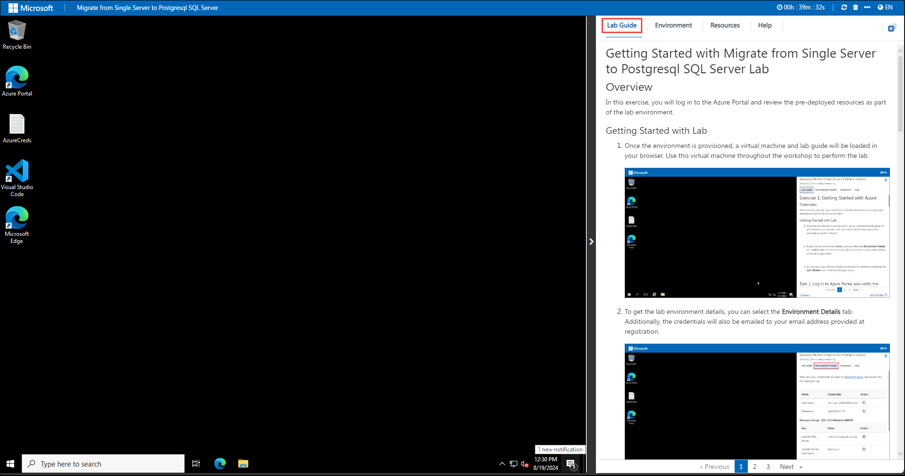
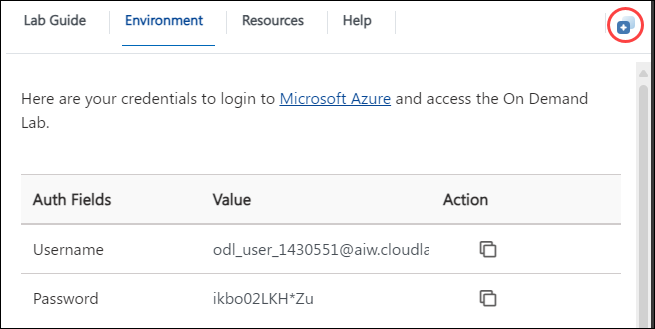

# Migrate from Single Server to Postgresql SQL Server Lab - Deploy Azure Database for Postgre SQL

### Overall Estimated Duration: 30 Minutes

## Overview

Azure Database for PostgreSQL is a fully managed database service provided by Microsoft Azure, offering PostgreSQL as the underlying database engine. It allows users to deploy, manage, and scale PostgreSQL databases in .This lab focuses on the deployment of a PostgreSQL Single Server using the Azure Portal, providing participants with hands-on experience in creating and configuring a fully managed database service.

## Objective

The objective of the PostgreSQL Migration lab is to equip participants with the skills to seamlessly migrate databases from a Single Server to a Flexible Server, by the end of this lab you will be able to:

- **Deploy Azure Database for PostgreSQL:** The objective is to get the understanding of the process of setting up a PostgreSQL Single Server, configuring it through the Azure Portal.

## Prerequisites

Participants should have:

- **Azure Platform Understanding:** Basic knowledge of Azure services, including Azure Database for PostgreSQL.

## Architechture

This architecture illustrates the deployment of a PostgreSQL Single Server using the Azure Portal. In this lab, the user will walk through the process of setting up a PostgreSQL Single Server, configuring it through the Azure Portal. This lab provides a foundational understanding of working with the Single Server setup in Azure.

## Architechture Diagram

## Explanation of Components

- **PostgreSQL Single Server:** The source database configuration, offering a simplified and managed PostgreSQL experience with basic customization options.

## Getting Started with Lab

1. Once the environment is provisioned, a virtual machine and lab guide will be loaded in your browser. Use this virtual machine throughout the workshop to perform the lab.

    

1. To get the lab environment details, you can select the **Environment Details** tab. Additionally, the credentials will also be emailed to your email address provided at registration.

    
    
1. You can also open the Lab Guide in a separate full window by selecting the **Split Window** icon at the bottom right corner.

     
     
## Log in to Azure Portal and verify the pre-deployed resources

In this task you will be Signing in to Azure Portal.

1. Open Azure Portal from the desktop by double-clicking on it.
    
   
   
2. On the **Sign into Microsoft Azure** tab, you will see the login screen, enter the following username, and then click on **Next**.

   * Email/Username: <inject key="AzureAdUserEmail"></inject>

   

3. Now enter the following password and click on **Sign in**. 

   * Password: <inject key="AzureAdUserPassword"></inject>

   

4. If you see the pop-up **Action Required**, click **Ask Later**.

   

5. If you see the pop-up **Stay Signed in?**, click on **No**.

   

6. If you see the pop-up **You have free Azure Advisor recommendations!**, close the window to continue the lab.

7. If a **Welcome to Microsoft Azure** popup window appears, click **Cancel** to skip the tour.

8. Now you can see the Azure Portal Dashboard, click on **Resource groups** from the Navigate panel to see the resource groups.

   
 
9. We have pre-deployed all the required resources already and you will be using them throughout the lab.

## Support Contact

The CloudLabs support team is available 24/7, 365 days a year, via email and live chat to ensure seamless assistance at any time. We offer dedicated support channels tailored specifically for both learners and instructors, ensuring that all your needs are promptly and efficiently addressed.

Learner Support Contacts:

- Email Support: cloudlabs-support@spektrasystems.com

- Live Chat Support: https://cloudlabs.ai/labs-support
   
Now, click on Next from the lower right corner to move to the next page.

### Happy Learning!!

 
